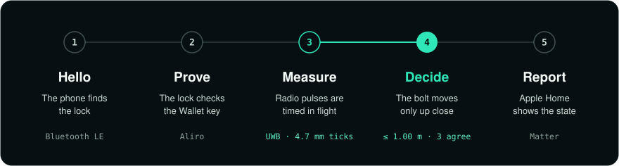
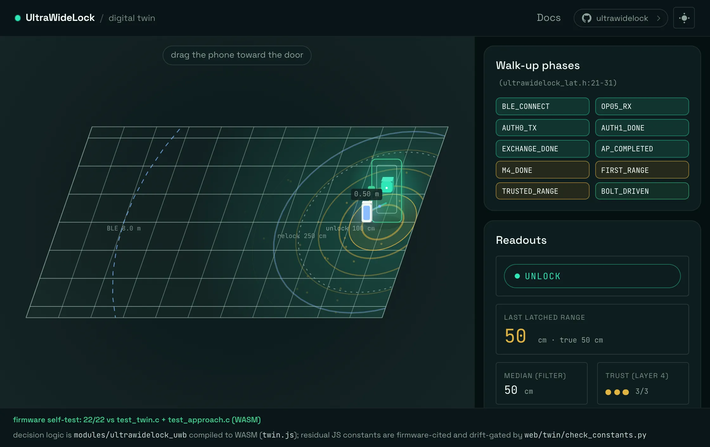

<div align="center">

<a href="https://ultrawidelock.com"></a>
<a href="LICENSE"></a>

**Walk up. It unlocks.**<br/>
Open-source firmware for a door lock that opens from Apple Wallet. No vendor app, account or cloud.

<a href="https://ultrawidelock.com/twin/index.html"></a>
<a href="https://ultrawidelock.com/flash/index.html"></a>

<br/>

<picture>
  <source media="(prefers-color-scheme: dark)" srcset="assets/grid-demo-dark.webp">
  <source media="(prefers-color-scheme: light)" srcset="assets/grid-demo-light.webp">
  
</picture>
<br/>
<sub>Home Key · Approach Direction · provisioning · NFC tap · live lock state</sub>
<br/><br/>

<br/>
<sub>A Wallet home key, on approach, recorded on hardware.</sub>

</div>

## Start

### 1. Run it on your computer

No board needed, only a C compiler and `python3`. This runs the firmware's 10,000+ host checks in about a minute.

```sh
git clone https://github.com/ultrawidelock/ultrawidelock.git
cd ultrawidelock
make check
```

### 2. Set up the toolchain

Do this once. It creates the key that signs your builds and installs the nRF Connect SDK v3.3.0.

```sh
make dfu-key
make bootstrap
```

### 3. Build and flash

Plug a Qorvo DWM3001CDK into USB by its J-Link port. There is nothing to wire.

```sh
make build
make flash
make monitor
```

`make monitor` opens the board's console, which prints the setup code.

### 4. Add the key

In the Home app, add an accessory and enter that setup code. Home adds the lock and puts its key in Wallet. Then walk up.

You need an iPhone with UWB on iOS 26 or later, a home hub and a Thread border router. The full walkthrough is in [add the key](docs/add-the-key.md).

### Another board

| Board | Unlocks by | Start with |
|---|---|---|
| **ESP32-S3 / C5 / C6** + DWM3000EVB | Approach | [wire the radio](docs/esp32-bringup.md), then [flash from the browser](https://ultrawidelock.com/flash/index.html) |
| **nRF5340 DK** + DWM3000EVB + NFC12A1 | Approach, tap | [bring-up guide](docs/nrf5340-bringup.md) |

## How it works

<div align="center">

</div>

Range is radio time of flight, so a relay can only make the phone look farther away.

## Digital twin

<div align="center">
<a href="https://ultrawidelock.com/twin/index.html"></a>
<br/>
<sub><a href="https://ultrawidelock.com/twin/index.html">Open the live twin</a> and drag the phone yourself.</sub>
</div>

## Documentation

[Guides](https://ultrawidelock.com/docs/index.html) ·
[Add the key](docs/add-the-key.md) ·
[Troubleshooting](docs/troubleshooting.md) ·
[Specification](docs/specification.md) ·
[Porting](PORTING.md) ·
[Contributing](CONTRIBUTING.md)

## License

[ISC](LICENSE) © 2026 asxeem and UltraWideLock contributors. Third-party terms are in [THIRD_PARTY_NOTICES](THIRD_PARTY_NOTICES).
